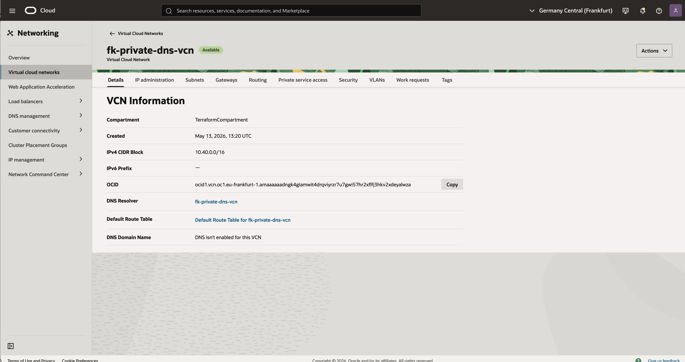
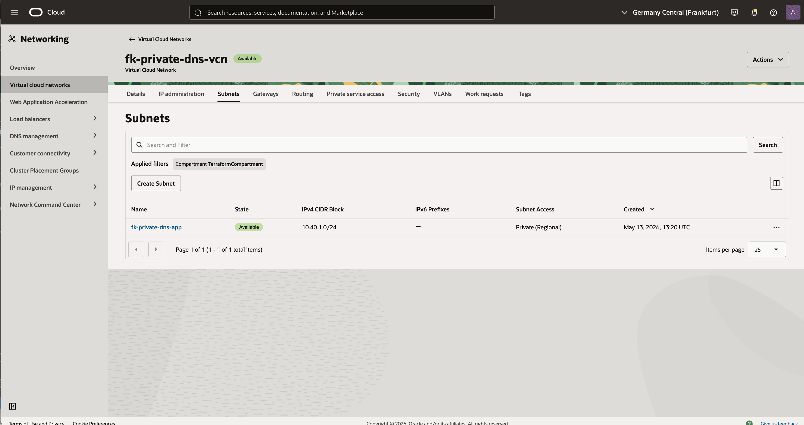
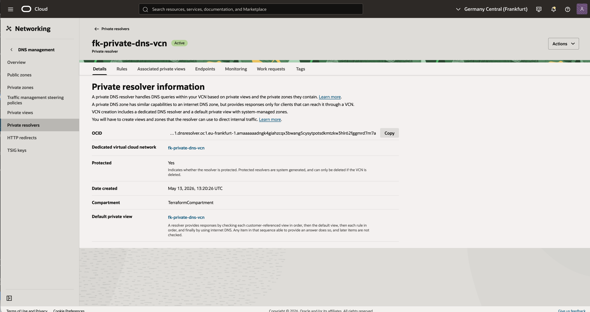
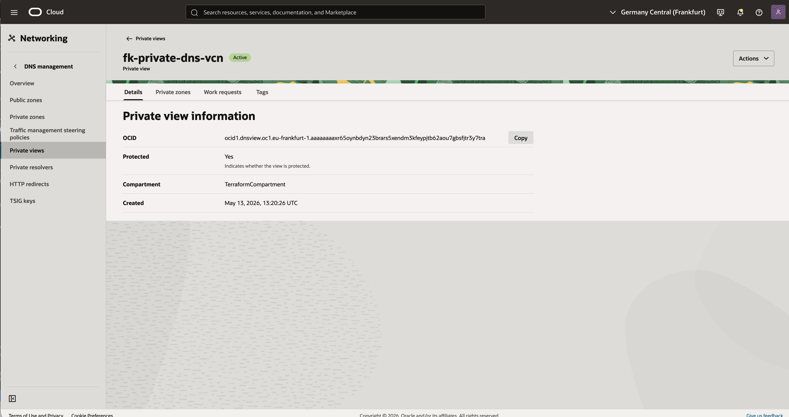
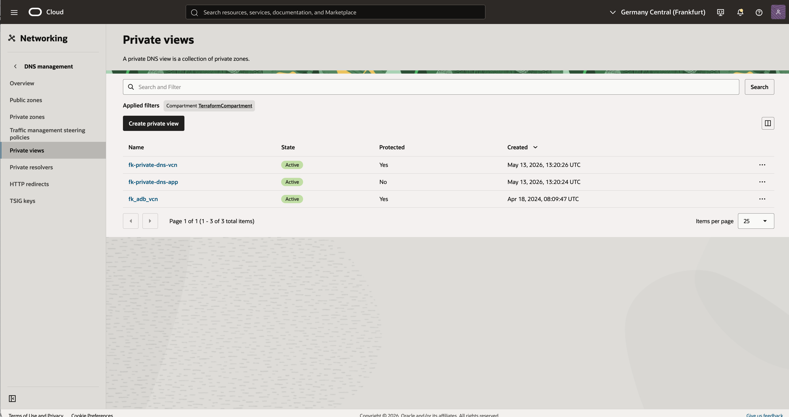
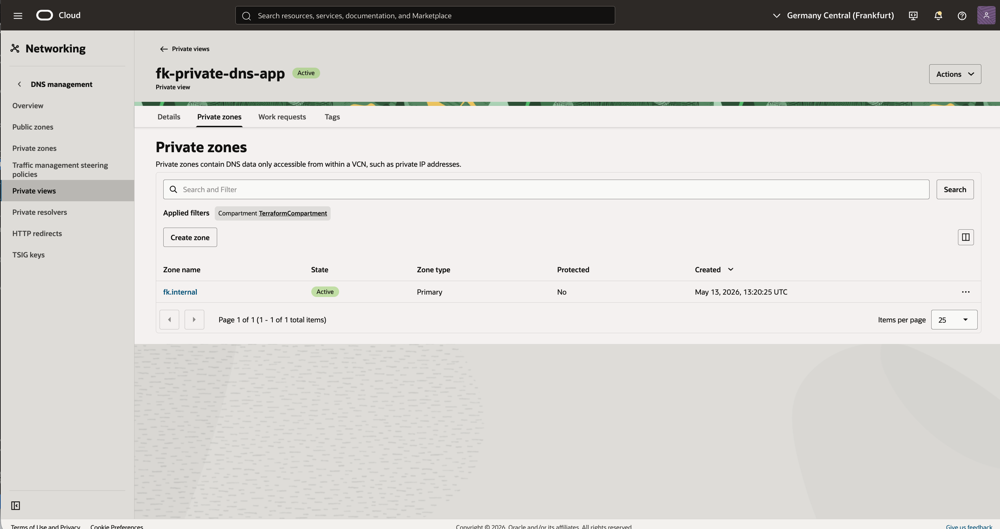
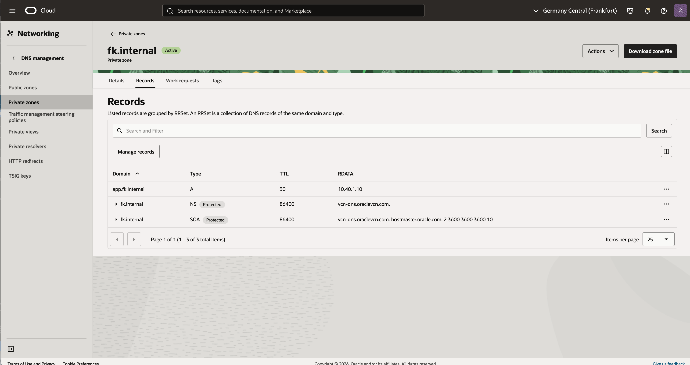

# Example 01: Basic Private DNS Zone

In this example, we deploy **one Oracle Cloud Infrastructure (OCI) Virtual Cloud Network (VCN)** and attach a **private DNS view** and **private DNS zone** to the VCN-associated private resolver using Terraform/OpenTofu.

This is the foundational private DNS scenario in OCI and a natural next step after creating a reusable VCN.

---

## 🧭 Architecture Overview

This deployment creates:

- One VCN in a single OCI region:
  - `fk-private-dns-vcn` (`10.40.0.0/16`)
- One private subnet:
  - `fk-private-dns-app` (`10.40.1.0/24`)
- One private DNS view
- One private DNS zone:
  - `fk.internal`
- One private A record:
  - `app.fk.internal -> 10.40.1.10`
- One resolver update that attaches the managed view to the VCN-associated private resolver

This example focuses on DNS composition, not on running workloads.
The `A` record points to a representative private address so the DNS workflow can be understood independently from compute provisioning.

---

## 🚀 Deployment Steps

Initialize and apply the Terraform/OpenTofu configuration:

```bash
cp terraform.tfvars.example terraform.tfvars
tofu init
tofu plan
tofu apply
```

After a successful deployment, Terraform will output:

- the VCN ID
- the private resolver ID
- the private view IDs
- the private zone IDs

---

## 🖼️ OCI Console Verification

After deployment, verify the following in OCI Console:

### VCN
- `fk-private-dns-vcn` with CIDR `10.40.0.0/16`
- subnet `fk-private-dns-app` with CIDR `10.40.1.0/24`

### Private DNS
- one private view attached to the VCN resolver
- one private zone named `fk.internal`
- one A record `app.fk.internal` pointing to `10.40.1.10`

This confirms that the VCN now has private DNS content attached to its resolver and can use private name resolution inside the network.

### Screenshots

**01. VCN details**

This view confirms that the example created the `fk-private-dns-vcn` VCN with CIDR `10.40.0.0/16`. It also shows the VCN-associated DNS resolver that will be used by the private DNS configuration.



**02. Subnet list**

This screen shows the private subnet `fk-private-dns-app` with CIDR `10.40.1.0/24`. It verifies that the DNS example is composed on top of a minimal reusable VCN foundation.



**03. Private resolver details**

This resolver page confirms that OCI created and activated the private resolver dedicated to the VCN. That resolver becomes the attachment point for the managed private view.



**04. Managed private view details**

This view shows the custom private DNS view created by the module. It is the logical container that holds the example private zone.



**05. Private views overview**

This list shows both the system-managed VCN private view and the custom view created by the example. It helps explain how OCI separates built-in resolver content from user-managed private DNS content.



**06. Private zone list**

This screen confirms that the example created the `fk.internal` private zone inside the custom view. The zone is active and ready to serve internal records through the VCN resolver.



**07. Private zone records**

This final screen shows the actual DNS records in the zone, including `app.fk.internal` pointing to `10.40.1.10`. It is the best end-to-end proof that the example successfully created usable private DNS data.



---

## 🧠 Design Notes

- The module uses the VCN-associated private resolver by default
- DNS views, zones, and RRsets stay separate from VCN construction
- This example keeps VCN provisioning inside `terraform-oci-fk-vcn`
- Private DNS resources and resolver view attachment stay inside `terraform-oci-fk-private-dns`

This is a practical building block for:

- private service naming
- internal platform DNS
- private endpoint naming conventions

---

## 🧹 Cleanup

To remove all resources created by this example:

```bash
tofu destroy
```

---

## ✅ Summary

This example demonstrates:

- how to create a private DNS view in OCI
- how to create a private zone and A record
- how to attach the view to the VCN-associated resolver
- how to compose `terraform-oci-fk-vcn` with `terraform-oci-fk-private-dns`

---

## 🌐 Learn More

Visit [FoggyKitchen.com](https://foggykitchen.com/) for OCI, multicloud, and Terraform/OpenTofu learning resources.

---

## 🪪 License

Licensed under the **Universal Permissive License (UPL), Version 1.0**.  
See [LICENSE](../../LICENSE) for more details.

---

© 2026 [FoggyKitchen.com](https://foggykitchen.com) - Cloud. Code. Clarity.
